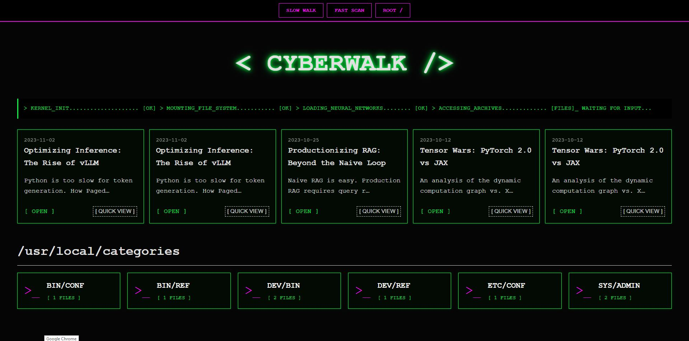

# < CYBERWALK / >

**A high-fidelity, cyberpunk-engineered theme interface for [Zola](https://www.getzola.org/).**



**CyberWalk** is a  **digital workspace** designed for technical architects, backend engineers, and systems administrators who communicate through code. It abandons modern minimalism for the raw, high-contrast aesthetics of a terminal boot sequence.

---

## // SYSTEM_CAPABILITIES

*   **📟 Immersive Terminal UX**: A UI that feels alive. Glowing text, scan-line artifacts, and a raw console aesthetic that pays homage to the golden age of hacking.
*   **⚡ Zero-Latency Performance**: Built on Zola's Rust engine. No bloated JavaScript frameworks. No hydration errors. Just pure, compiled HTML/CSS delivered at the speed of light.
*   **🗂️ Reactive Grid System**: Your taxonomies (Tags/Categories) are visualized as a mounted file system, utilizing a responsive CSS grid that adapts from 4K monitors to mobile viewports.
*   **🛠️ Syntax-First Design**: Custom-tuned syntax highlighting for code blocks, ensuring your Rust, Python, and Go snippets look readable and vibrant against the void.
*   **🔍 Directory-Level Navigation**: Structured browsing that mimics a file explorer context, perfect for organizing documentation, dev-logs, and research papers.

---

## // PROTOCOLS

### Clone Repository

Pull the source code directly into your themes directory.

```bash
git clone https://github.com/plantacerium/zola-theme-cyber-walk.git
```

---

## // SYSTEM_CONFIGURATION

Inject the following variables into your root `config.toml` to initialize the visual subsystem.

```toml
# THEME ACTIVATION
theme = "CyberWalk"

# METADATA CONFIGURATION
title = "MY_CONSOLE"
description = "System Online. Awaiting Input."

# SYSTEM VARIABLES
[extra]
system_status = "ONLINE"  # Status indicator displayed in the header
```

---

## // CUSTOMIZATION_VECTORS

The visual parameters are defined in `sass/_variables.scss` (or similar). You can override them to match your preferred color scheme (e.g., changing the primary glow from Matrix Green to Cyberpunk Pink or Amber).

*   `$glow-color`: Primary terminal phosphor color.
*   `$bg-color`: The void background.
*   `$font-stack`: Monospace font priority.

---

## // LICENSE

Released under the **MIT License**.

## Support
<div align="center">
**Made with ❤️ and ☕ by the Plantacerium**

[](https://ko-fi.com/plantacerium)

⭐ **Star us on GitHub** ⭐
</div>
